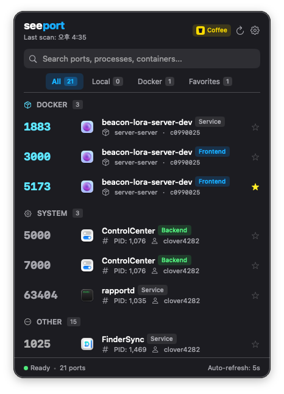
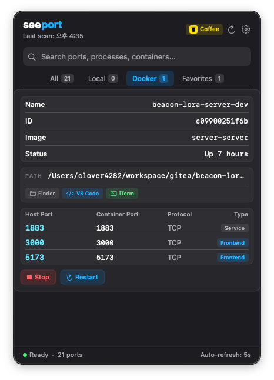

# Seeport

A lightweight macOS menu bar app for monitoring listening TCP ports and Docker containers in real-time.

  

## Screenshots

<p align="center">
  
  &nbsp;&nbsp;
  
</p>

## Overview

Seeport runs in your macOS menu bar and provides instant visibility into what's listening on your local ports. With a single click, see which process owns each port, Docker containers, and manage your network services—all without cluttering your dock.

**Key Features:**
- Real-time port scanning with process detection
- Docker container monitoring and port mapping
- Intelligent port categorization (Frontend / Backend / Database / Docker / System / Other)
- Favorites with star toggle
- External editor integration (VS Code, Cursor, Zed, Sublime, WebStorm, IntelliJ, Xcode, Neovim)
- Shell integration (iTerm2, Terminal, Warp, Alacritty, Kitty) — opens in new window
- Open any port in browser with one click (`localhost:{port}`)
- Optional HTTP server (port 7777) with web UI and JSON API
- Start at login (auto-start on macOS startup)
- Auto-refresh with configurable interval
- Smart notifications with per-category control (Local / Docker / System / Other)
- In-app bug reporting (via system email client)
- Sparkle auto-update support

## Getting Started

### Requirements

- macOS 13 or later
- Swift 5.9 or later
- Docker CLI (optional, for container detection)
- `fswatch` (optional, only for `make dev`)

### Installation

**Download the latest release:**

Download `seeport-v1.4.zip` from [Releases](https://github.com/clover4282/seeport/releases), unzip, and move `seeport.app` to `/Applications`.

**Or build from source:**

```bash
git clone https://github.com/clover4282/seeport.git
cd seeport
make run
```

### Environment (optional)

Copy `.env.example` to `.env` and fill in Paddle credentials for licensing. In dev mode (no credentials), any non-empty license key is accepted.

## Usage

### Menu Bar Interface

- **Menu Icon**: Anchor symbol in the macOS menu bar
- **Popover**: 420x600px window showing ports grouped by category
- **Search**: Filter by port number, process name, or category
- **Tabs**: All / Local / Docker / Favorites
- **Star**: Click the star icon on any port card to toggle favorite

### Port Categories

Ports are automatically categorized:

| Priority | Source | Example |
|----------|--------|---------|
| 1 | User overrides | Custom categories you define |
| 2 | Docker | Ports mapped from Docker containers |
| 3 | System commands | Detected via process name |
| 4 | Regex patterns | Process name matching |
| 5 | Port ranges | 3000-3999 Frontend, 8000-8999 Backend, etc. |

### Settings

Click the gear icon in the header:

- **General** — Auto-refresh, refresh interval, start at login
- **Notifications** — New/closed port events, per-category toggles (Local/Docker/System/Other)
- **Tools** — Preferred editor and shell app
- **About** — Version, bug report, check for updates

## Development

### Build Commands

```bash
make build    # Build Swift package
make run      # Build → bundle → launch app
make debug    # Build → run in foreground (stdout visible)
make dev      # Watch mode with auto-rebuild (requires fswatch)
make clean    # Clean build artifacts
```

### Release

```bash
make release VERSION=1.4   # Bundle → ZIP → Sparkle signature
make deploy VERSION=1.4    # release + GitHub release
```

### Test Servers

```bash
make test-servers       # Start Python HTTP servers on 8080/13000/9999
make test-servers-stop  # Stop all test servers
```

## Architecture

```
PortScanner (lsof)  →  PortInfo structs
         ↓
DockerService (docker ps)  →  DockerContainer data
         ↓
ProcessService (NSWorkspace)  →  App icons & process info
         ↓
CategoryEngine  →  Classify ports into categories
         ↓
PortListViewModel (@Published)  →  SwiftUI views
         ↓
MainPopoverView / WebServer  →  User interface
```

### Core Components

| Component | Type | Role |
|-----------|------|------|
| **PortScanner** | Actor | `lsof` based port scanning |
| **DockerService** | Actor | Docker container detection with absolute path lookup |
| **CategoryEngine** | Enum | Multi-stage port classification |
| **ProcessService** | Enum | App icons, working directory, process kill |
| **PortListViewModel** | ObservableObject | Central state holder |
| **WebServer** | Class | HTTP server on port 7777 (Network framework) |
| **LicenseManager** | Class | 30-day trial + Paddle API |

### Key Design Decisions

- **Actor concurrency** for thread-safe scanning
- **Absolute Docker path lookup** — searches `/usr/local/bin/docker`, `/opt/homebrew/bin/docker`, etc. to work in GUI app context where PATH is minimal
- **`open -a` for editors** — avoids PATH dependency when launching VS Code, Cursor, etc.
- **AppleScript for iTerm/Terminal** — opens new window instead of tab
- **Dark theme** — background RGB(0.11, 0.11, 0.13) with blue/cyan accent
- **UserDefaults persistence** — all state with `seeport.*` prefix, no Core Data
- **Single dependency** — Sparkle only (for auto-updates)

## HTTP API

When enabled, the web server on port 7777 provides:

| Method | Endpoint | Description |
|--------|----------|-------------|
| GET | `/` | Web UI |
| GET | `/api/ports` | JSON array of listening ports |
| POST | `/api/ports/{port}/kill` | Terminate process on port |
| POST | `/api/ports/{port}/favorite` | Toggle favorite status |

## Project Structure

```
Sources/seeport/
├── App/              # App entry point & delegate
├── Models/           # PortInfo, PortCategory, DockerContainer
├── Services/         # PortScanner, DockerService, CategoryEngine, WebServer
├── ViewModels/       # PortListViewModel
├── Views/            # SwiftUI views (Popover, Cards, Settings, etc.)
├── Utilities/        # ShellExecutor, Constants, Favorites, SettingsManager
└── Resources/        # Info.plist, AppIcon.icns
```

## License

MIT License - see LICENSE file for details.

## Support

For issues or feature requests, [open an issue](https://github.com/clover4282/seeport/issues) on GitHub.

---

**Seeport** — Know what's listening, at a glance.
